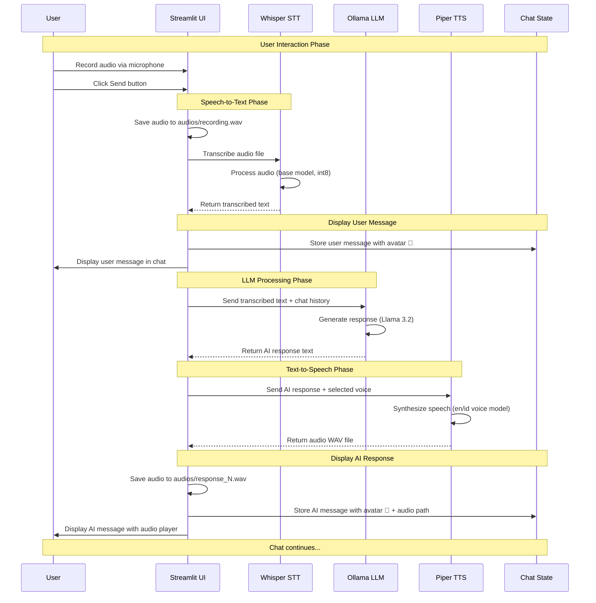

# 🎙️ Local Voice Agent

A fully local, privacy-focused voice agent that lets you have natural conversations with an AI using speech. All processing happens on your machine - no cloud services, no API keys, no data leaves your computer.

## ✨ Features

- 🎤 **Voice Input**: Record your voice directly in the browser
- 🗣️ **Multi-language TTS**: Choose between English and Indonesian voice synthesis
- 💬 **Chat Interface**: Modern ChatGPT-style conversation view with message history
- 🤖 **Local LLM**: Powered by Llama 3.2 running on Ollama
- 🔒 **100% Private**: All processing (STT, LLM, TTS) happens locally
- 📊 **Session Tracking**: View message count and current settings in the sidebar

## 🏗️ Technology Stack

| Component           | Technology         | Model/Version                              |
| ------------------- | ------------------ | ------------------------------------------ |
| **Speech-to-Text**  | Faster Whisper     | base (int8)                                |
| **Language Model**  | Ollama             | Llama 3.2                                  |
| **Text-to-Speech**  | Piper TTS          | en_US-lessac-medium, id_ID-news_tts-medium |
| **Frontend**        | Streamlit          | Latest                                     |
| **Audio Recording** | streamlit-audiorec | Latest                                     |

## 📋 Prerequisites

- Python 3.12+
- [Ollama](https://ollama.ai/) installed with Llama 3.2 model
- Microphone access in your browser

## 🚀 Installation

1. **Clone the repository**

```bash
git clone https://github.com/mcikalmerdeka/nlp-learning.git .
cd voice-agent
```

2. **Install dependencies**

```bash
# Using uv (recommended)
uv venv .venv
.venv\Scripts\Activate.ps1  # Windows
source .venv/bin/activate    # Linux/Mac

# Utilize the requirements.txt combined with uv
uv add install -r requirements.txt

# Utilize the pyproject.toml and uv.lock
uv sync

# Or using pip
pip install -r requirements.txt
```

3. **Install Ollama and pull Llama 3.2**

```bash
ollama pull llama3.2:latest
```

4. **Download Piper voice models** (if not included)

You can add new voices from here [piper-voices](https://huggingface.co/rhasspy/piper-voices/tree/main)

- Place voice models in `voices/en/` and `voices/id/` directories
- Models should include both `.onnx` and `.onnx.json` files

## 🎮 Usage

1. **Start Ollama service** (required before running the app)

```bash
ollama serve
```

> **Note**: On Windows, if you have the Ollama desktop app installed, the service usually starts automatically. Otherwise, run `ollama serve` in a separate terminal window and keep it running.

2. **Start the application**

```bash
streamlit run local_voice_agent.py
```

3. **Open your browser** (usually auto-opens at `http://localhost:8501`)
4. **Select voice language** from the sidebar (English or Indonesian)
5. **Record your message** using the microphone button at the bottom
6. **Click Send** and wait for the AI to respond with synthesized speech
7. **Continue the conversation** - all messages are saved in the chat history

## 🔄 How It Works



**Flow:**

1. **User Input**: User records voice via browser microphone using `streamlit-audiorec` widget
2. **Audio Capture**: Audio is saved as `recording.wav` in the `audios/` directory
3. **Speech Recognition**: Faster Whisper transcribes the audio to text (base model with int8 quantization)
4. **Display User Message**: Transcribed text is added to session state and displayed in chat with 👤 avatar
5. **LLM Generation**: User message + chat history is sent to Llama 3.2 via Ollama for response generation
6. **Speech Synthesis**: AI response text is converted to speech using Piper TTS (selected language: EN or ID)
7. **Save Audio**: Generated speech is saved as `response_N.wav` in `audios/` directory
8. **Display AI Response**: AI message is displayed in chat with 🤖 avatar and embedded audio player
9. **Session Persistence**: All messages and audio paths remain in Streamlit session state for conversation continuity

## 🛠️ Utility Scripts

### Check Available Ollama Models

```bash
python check_ollama_models.py
```

Lists all Ollama models installed on your system.

### Check Available Microphones

```bash
python check_mic.py
```

Lists all audio input devices detected on your system.

## 📁 Project Structure

```
voice-agent/
├── audios/              # Stored audio recordings and responses
├── voices/              # TTS voice models
│   ├── en/             # English voice models
│   └── id/             # Indonesian voice models
├── local_voice_agent.py # Main Streamlit application
├── check_mic.py         # Microphone testing utility
├── check_ollama_models.py # Ollama model checker
├── requirements.txt     # Python dependencies
└── README.md           # This file
```

## 🎨 Customization

### Adding New Voice Languages

Edit the `VOICE_CONFIG` dictionary in `local_voice_agent.py`:

```python
VOICE_CONFIG = {
    "English (US)": {
        "lang_code": "en",
        "model": "en_US-lessac-medium.onnx"
    },
    "Your Language": {
        "lang_code": "xx",
        "model": "your_model.onnx"
    }
}
```

### Changing the LLM Model

Modify line 28 in `local_voice_agent.py`:

```python
model = ChatOllama(model="llama3.2:latest")  # Change to your preferred model
```

### Adjusting Whisper Model Size

Modify line 32 to use a different model size (tiny, base, small, medium, large):

```python
return WhisperModel("base", device="cpu", compute_type="int8")
```

## 🔧 Troubleshooting

**Issue**: `llvmlite` installation fails

- **Solution**: This project uses `faster-whisper` which supports Python 3.12+. If you see this error, ensure you're not using the old `openai-whisper` package.

**Issue**: No audio playback

- **Solution**: Check that voice model files (.onnx and .onnx.json) exist in the correct directories under `voices/`.

**Issue**: Ollama connection error

- **Solution**: Ensure Ollama is running (`ollama serve`) and the model is pulled (`ollama pull llama3.2:latest`).

**Issue**: Microphone not working

- **Solution**: Grant microphone permissions to your browser when prompted.

## 🙏 Acknowledgments

- [Faster Whisper](https://github.com/guillaumekln/faster-whisper) - Efficient speech recognition
- [Ollama](https://ollama.ai/) - Local LLM inference
- [Piper TTS](https://github.com/rhasspy/piper) - High-quality text-to-speech
- [Streamlit](https://streamlit.io/) - Web interface framework
- [LangChain](https://langchain.com/) - LLM orchestration
